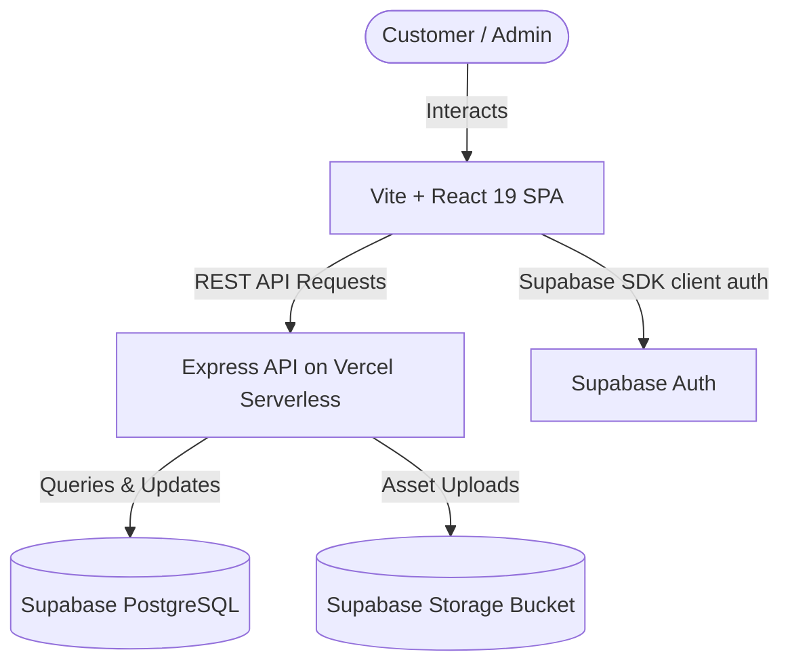

# 👕 Ulvic Print

> **Wear Your Mind with Ulvic Print** — A premium custom apparel printing e-commerce platform and back-office management system tailored for the Algerian market.

[](https://vite.dev/)
[](https://react.dev/)
[](https://www.typescriptlang.org/)
[](https://tailwindcss.com/)
[](https://supabase.com/)
[](https://expressjs.com/)

---

## 📖 Overview

**Ulvic Print** is a full-stack web application designed for a custom merchandise and t-shirt printing business in Algeria. It offers a sleek, modern, bilingual showcase for customers to browse and order custom-printed clothing, alongside a comprehensive, secure back-office dashboard for administrators to manage products, coordinate deliveries across all 58 Algerian Wilayas, and export logistics spreadsheets.

---

## ✨ Features

### 🛒 Customer-Facing Portal
- **Stunning UI/UX**: Dark mode theme with premium glassmorphic cards, micro-interactions, Outfit & Space Grotesk typography, and glow highlights.
- **Bilingual Interface**: Seamless translation switcher between **English (EN)** and **French (FR)** powered by `react-i18next`.
- **Algerian Logistics Engine**: Integrated checkout form configured for the 58 Wilayas of Algeria, supporting **Home Delivery** and **Desk Pickup** (Livraison à domicile / Bureau) with automated delivery fee calculations.
- **Product Options**: Detailed visual selectors for product categories, sizes (S, M, L, XL, etc.), colors, and zoomable images.

### 🛡️ Admin Management Dashboard
- **Secure Authentication**: Protected dashboard via JWT/session administration controls.
- **Order Tracking & Lifecycle**: Monitor orders through status pipelines: `New`, `Confirmed`, `Shipped`, `Delivered`, and `Cancelled`.
- **Inventory Management**: Create, edit, delete products, and toggle stock availability in real-time.
- **Dynamic Delivery Pricing**: Bulk editor to customize shipping fees for every Wilaya.
- **Excel Logistics Export**: Download order data directly into `.xlsx` formats for shipping agencies and accounting sheets.
- **Image Uploader**: Upload high-resolution product imagery directly into Supabase Storage.

---

## 🏗️ Architecture

The application is structured as a decoupled Single Page Application (SPA) with a serverless backend API connected to a secure relational database.



---

## 🛠️ Tech Stack

- **Frontend**:
  - [React 19](https://react.dev/) & [Vite](https://vite.dev/)
  - [TypeScript](https://www.typescriptlang.org/) (Strict Typings)
  - [Tailwind CSS v4](https://tailwindcss.com/)
  - [Lucide React](https://lucide.dev/) (Icons)
  - [React Router DOM v7](https://reactrouter.com/) (Routing)
  - [i18next](https://www.i18next.com/) (Localization)
- **Backend API**:
  - [Express](https://expressjs.com/) (Node.js framework)
  - [Dotenv](https://github.com/motdotla/dotenv) (Environment config)
  - [Multer](https://github.com/expressjs/multer) (File processing)
- **Database & Services**:
  - [Supabase PostgreSQL](https://supabase.com/)
  - [Supabase Storage](https://supabase.com/docs/guides/storage)
  - [SheetJS (xlsx)](https://sheetjs.com/) (Spreadsheet generation)
- **Deployment**:
  - [Vercel Serverless Functions](https://vercel.com/docs/functions)

---

## 🗄️ Database Schema

The PostgreSQL schema consists of three core tables deployed on Supabase:

### `products`
Stores merchandise information:
```sql
CREATE TABLE products (
  id UUID PRIMARY KEY DEFAULT gen_random_uuid(),
  name_en TEXT NOT NULL,
  name_fr TEXT NOT NULL,
  description_en TEXT,
  description_fr TEXT,
  price INTEGER NOT NULL,          -- Price in DZD
  category TEXT,
  images TEXT[] DEFAULT '{}',     -- Array of Storage URLs
  sizes TEXT[] DEFAULT '{}',      -- e.g., ['S', 'M', 'L']
  colors JSONB DEFAULT '[]',      -- e.g., [{"label":"Black","hex":"#000000"}]
  in_stock BOOLEAN DEFAULT true,
  created_at TIMESTAMPTZ DEFAULT now()
);
```

### `orders`
Captures user purchase details:
```sql
CREATE TABLE orders (
  id UUID PRIMARY KEY DEFAULT gen_random_uuid(),
  created_at TIMESTAMPTZ DEFAULT now(),
  product_id UUID REFERENCES products(id) ON DELETE SET NULL,
  product_name TEXT NOT NULL,
  size TEXT NOT NULL,
  color TEXT NOT NULL,
  customer_name TEXT NOT NULL,
  phone TEXT NOT NULL,
  wilaya TEXT NOT NULL,
  baladiya TEXT NOT NULL,
  delivery_type TEXT NOT NULL,    -- 'home' | 'desk'
  delivery_fee INTEGER NOT NULL DEFAULT 0,
  total_price INTEGER NOT NULL,
  status TEXT NOT NULL DEFAULT 'new'
);
```

### `delivery_prices`
Maps delivery fees dynamically per wilaya:
```sql
CREATE TABLE delivery_prices (
  wilaya TEXT PRIMARY KEY,
  fee INTEGER NOT NULL DEFAULT 0   -- Fee in DZD
);
```

---

## 🚀 Getting Started

### Prerequisites
- [Node.js](https://nodejs.org/) (v18+)
- [pnpm](https://pnpm.io/) (recommended) or `npm` / `yarn`
- A [Supabase](https://supabase.com/) project initialized

### 1. Clone & Install Dependencies
```bash
git clone https://github.com/your-username/ulvic.git
cd ulvic
pnpm install
```

### 2. Configure Environment Variables
Create a `.env` file in the root of the project. You can copy the template from `.env.example`:
```bash
cp .env.example .env
```
Fill in the credentials:
```ini
# Frontend Variables (Client)
VITE_SUPABASE_URL=https://your-project-id.supabase.co
VITE_SUPABASE_ANON_KEY=your-supabase-anon-key
VITE_API_URL=/api

# Backend Variables (Server runtime)
SUPABASE_URL=https://your-project-id.supabase.co
SUPABASE_SERVICE_ROLE_KEY=your-supabase-service-role-key
NODE_ENV=development
PORT=5000
```

### 3. Database Migration Setup
Connect to your Supabase SQL Editor and run the SQL migration found in:
* [`supabase/migrations/20260605000000_init.sql`](file:///c:/Users/Admin/Downloads/ulvic/supabase/migrations/20260605000000_init.sql)

This will set up the required table structures and seed the database with all 58 Algerian Wilayas and baseline shipping fees.

### 4. Running Locally
Run both the development frontend and local backend.

```bash
# Start the Vite client dev server
pnpm run dev
```

*Note: In local development, the backend automatically runs via the express proxy configured in your Vite configuration, or by running the backend separately (`node api/index.ts` / `tsx api/index.ts`)*

---

## 📦 Deployment

### Deploying to Vercel
This project is pre-configured with a [vercel.json](file:///c:/Users/Admin/Downloads/ulvic/vercel.json) file that maps the Express server route configurations to Vercel Serverless Functions.

1. Install Vercel CLI globally:
   ```bash
   npm install -g vercel
   ```
2. Link your project and deploy:
   ```bash
   vercel
   ```
3. Set your production environment variables in your Vercel Project Dashboard settings (`SUPABASE_URL`, `SUPABASE_SERVICE_ROLE_KEY`, `VITE_SUPABASE_URL`, `VITE_SUPABASE_ANON_KEY`, `NODE_ENV=production`).

---

## 📝 License
Distributed under the MIT License. See `LICENSE` for more information.
